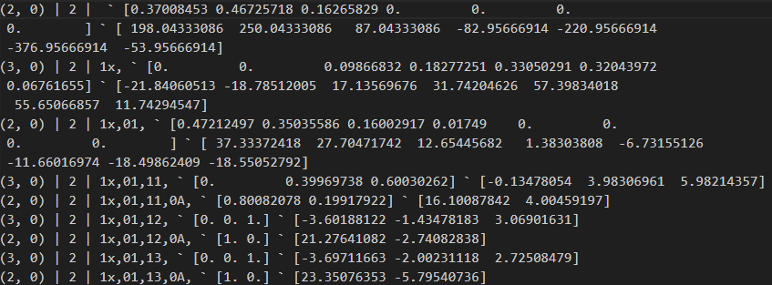

# Poker CFR (Counter Factual Regret Minimization)
## This program uses counter factual regret minimization to solve the nash equilibrium (Most Optimal Strategy) for the flop for heads up (1v1) poker. It also contains the logic for poker, and calculating poker odds. This is implemented in the following files: oth.py, per_calc.py, poker_calc.py. The poker_cfr_flop_2.py file contains the logic for the CFR.

# Counter Factual Regret Minimization
### CFR is a very effective way of calculating the risk and reward for decisions in games where we don't have all of the information. It learns by determining the reward for decisions, and adjusting it's strategy accordingly. An easy game we can apply this to is Rock, Paper, Scissors (RPS). Obviously the nash equilibrium is picking at random because if you follow any sort of pattern, your opponent can take advantage of it. So to calculate the regret for a decision in RPS, we can use the example of Rock vs. Paper. The person who chose rock would recieve regret for that decision, and therefore be more likely to not choice that in the future. They will also be more inclined to choose scissors because that would've made them win. And paper would be unaffected. If you keep doing this, you will eventually come to the conclusion that choosing at random is the best strategy. It is a lot more complicated in poker, but it is the same idea.

# Modifications for Efficiency
### I know I have heard it somewhere, but supposedly, poker has more possibilities than atoms in the universe. Which means that without some sort of quantum computing, this would take lifetimes to solve. Since I didn't want to wait lifetimes, I came up with a different solution. This one does lose out on some accuracy, but it is a trade-off I am more than willing to take. Instead of performing this for every possible combination of cards, my plan was to come up with an amount of hands that would win in a scenario, and then classify it into a percentile(Bottom 20%, Top 20%, etc.). This way I would account for trillions of possibilities without having to test each individual one. My plan was to just run a loop and test out every possible hand, but when there are 5 cards to come out, and multiple players, it would still take a ton of time. To solve this problem, I decided to copy how my human brain thinks, and come up with the hands that beat me, and then calculate the odds of those cards coming out on the table. That way, I would only have to account for the cards coming out on the table, and not for all cards. I also planned on using a chart for pre-flop to save a lot of time. This saved a ton of time, and made this possible.

# **RESULTS!!!**
## Hopefully my explanation has made you as excited about this as I am. After training on 50,000 games of poker, it has learned a lot. I have a couple images, one from the 50th epoch, and one from the 5000th epoch. This way we can really see what it's learned. First, I am going to explain how to read the data.

#### Some of the lines are wrapping, but each new line starts with a tuple. Each line is formatted like this - (Win classification(higher is better), Tie classification) | Number of players | History ` [Strategy] ` [Regret sum]
#### The strategy and regret sum's length depends on the number of actions.
